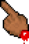
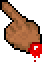
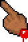
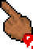
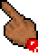
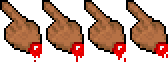

<div align="center">

# NESticle Custom Cursor & Barebones Demo

<p align="center">
  
</p>

**The iconic severed hand cursor with dripping blood from 1997's NESticle DOS emulator.**

A lightweight barebones web demo and standalone, zero-dependency drop-in custom cursor package.

<p align="center">
  <a href="https://powerje.github.io/nesticle-cursor.js/"></a>
  <a href="https://github.com/powerje/nesticle-cursor.js/actions/workflows/pages.yml"></a>
  <a href="https://github.com/powerje/nesticle-cursor.js/actions/workflows/test.yml"></a>
  <a href="LICENSE"></a>
  
  
</p>

[**Live Demo**](https://powerje.github.io/nesticle-cursor.js/) • [**Upstream Repo**](https://github.com/FragmentedCurve/nesticle-theme) • [**Quick Start**](#how-to-use-the-cursor-in-another-project)

</div>

---

## Visual Animation Breakdown

The original cursor animation loops across 4 frames extracted directly from NESticle's emulator code, cycling every 200 milliseconds (800ms total loop):

| Frame 0 (0ms) | Frame 1 (200ms) | Frame 2 (400ms) | Frame 3 (600ms) |
| :---: | :---: | :---: | :---: |
|  |  |  |  |
| *Initial detachment* | *Blood droplet falls* | *Droplet falls further* | *New droplet forming* |

### Spritesheet (168 × 62 px)
Full horizontal sprite sheet included for CSS sprite animation or game engine imports:

<p align="left">
  
</p>

---

## Live Demo

Experience the cursor live on GitHub Pages:
👉 **[https://powerje.github.io/nesticle-cursor.js/](https://powerje.github.io/nesticle-cursor.js/)**

---

## Upstream Project & Credits

- **Cursor Assets Source**: Extracted from [**FragmentedCurve/nesticle-theme**](https://github.com/FragmentedCurve/nesticle-theme), which extracted and rendered the original 4 cursor animation frames directly from NESticle's binary code into an X11 cursor theme.
- **Original NESticle Emulator**: Created in 1997 by **Icer Addis** (Sardu) of **Bloodlust Software**. NESticle was famed for its humor and edgy 90s aesthetic, including this custom pointer.

---

## Cursor Modes & Browser Compatibility

Because modern web browsers (Chrome, Safari, Firefox) intentionally do not animate GIF images when set via standard CSS `cursor: url('...'), auto;`, this project provides three modes to handle every use case:

| Mode | Description | Latency | Animation | Best Used For |
|---|---|---|---|---|
| **Hardware OS Cursor** (`native-swap`, *Default*) | Uses the operating system's native hardware cursor everywhere (including over buttons, links, and inputs). | Zero latency (native OS compositor) | 200ms frame swapping | **Recommended**: Maximum performance, zero DOM overhead, works across all elements. |
| **Follower** (`follower`) | Lightweight DOM element tracking mouse coordinates with the transparent animated GIF. | 60+ fps fluid tracking | Full 200ms dripping blood loop | Environments where CSS cursor updates are restricted. |
| **Static CSS** (`static`) | Pure CSS fallback using Frame 0 (pointing severed hand) with zero JavaScript required. | Zero latency | Static (no drip) | Minimalist setups or non-JS environments. |

---

## Running Locally

This project uses **[Deno](https://deno.com/)** as its primary runtime:

```bash
# Start the local development server (port 3000)
deno task dev
```

Then visit [http://localhost:3000](http://localhost:3000) in your browser.

### Other Useful Tasks

```bash
# Run Deno linter
deno task lint

# Run Deno type/syntax checks
deno task check

# Run Playwright E2E browser tests
deno task test:e2e
```

*(Alternative using Python: `uv run python -m http.server 3000`)*

---

## How to Use the Cursor in Another Project

The cursor is self-contained in the [`nesticle-cursor/`](nesticle-cursor/) folder.

### 1. Copy the Directory
Copy the [`nesticle-cursor/`](nesticle-cursor/) directory into your destination web project.

### 2. Add to Your HTML
```html
<!-- Include stylesheet and script -->
<link rel="stylesheet" href="nesticle-cursor/nesticle-cursor.css">
<script src="nesticle-cursor/nesticle-cursor.js"></script>

<script>
  const cursor = new NesticleCursor({
    mode: 'native-swap', // 'native-swap' | 'follower' | 'static'
    scale: 1,            // 1 = 42x62px, 1.5 = 63x93px, 2 = 84x124px
    clickEffect: true    // Optional retro blood drop splatter on click
  });
</script>
```

### 3. React / Next.js / Vue Usage
```jsx
import { useEffect } from 'react';
import './nesticle-cursor/nesticle-cursor.css';
import NesticleCursor from './nesticle-cursor/nesticle-cursor.js';

export default function App() {
  useEffect(() => {
    const cursor = new NesticleCursor({
      mode: 'native-swap',
      basePath: '/nesticle-cursor/'
    });

    return () => cursor.destroy();
  }, []);

  return <div>Your application content</div>;
}
```

### 4. Zero-JS Pure CSS Option
```css
html, body, a, button, input {
  cursor: url('nesticle-cursor/assets/nesticle.png') 0 0, auto !important;
}
```

---

## Configuration API

```javascript
const cursor = new NesticleCursor({
  mode: 'native-swap',             // 'native-swap' | 'follower' | 'static'
  scale: 1,                        // Scaling factor (default: 1)
  clickEffect: true,               // Enable/disable pixelated blood splatter on click
  basePath: './nesticle-cursor/',  // Relative or absolute path to assets directory
  target: document.documentElement // Target element or CSS selector (default: root)
});

// Dynamic methods:
cursor.setMode('native-swap');     // Switch modes at runtime
cursor.setScale(1.5);              // Resize cursor
cursor.setClickEffect(false);      // Toggle click splatter
cursor.destroy();                  // Unbind events, remove DOM elements, restore OS cursor
```

---

## Project Structure

```
nesticle-cursor.js/
├── index.html                     # Minimal barebones demo website
├── style.css                      # Demo page styling
├── main.js                        # Demo interactivity and mode controls
├── deno.json                      # Deno tasks (dev, serve, lint, check, test)
├── package.json                   # Convenience scripts
├── README.md                      # This file
├── LICENSE                        # MIT License
├── .github/workflows/             # GitHub Actions CI & Pages deployment
│   ├── pages.yml
│   └── test.yml
├── tests/                         # Automated Playwright test suite
│   └── test_e2e.py
└── nesticle-cursor/               # PORTABLE CURSOR PACKAGE (Drop this anywhere!)
    ├── nesticle-cursor.js         # Zero-dependency controller (UMD / ES Module)
    ├── nesticle-cursor.css        # Follower styles, cursor suppression, splatter
    ├── README.md                  # Drop-in integration reference
    └── assets/
        ├── nesticle.gif           # 4-frame transparent animated GIF (42x62 px, 200ms)
        ├── nesticle.png           # Frame 0 static pointing finger PNG
        ├── spritesheet.png        # 168x62 px horizontal 4-frame sprite sheet
        └── frames/                # Extracted individual PNG frames (200ms delay each)
            ├── frame_0.png
            ├── frame_1.png
            ├── frame_2.png
            └── frame_3.png
```

---

## License & Attribution

- Cursor art originally by **Icer Addis / Bloodlust Software** (NESticle, 1997).
- Cursor extraction by **FragmentedCurve** via [nesticle-theme](https://github.com/FragmentedCurve/nesticle-theme).
- Web port, JavaScript controller, and demo website provided under the MIT License.
